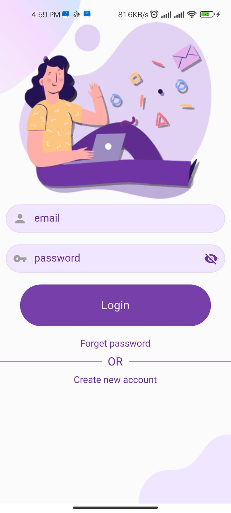
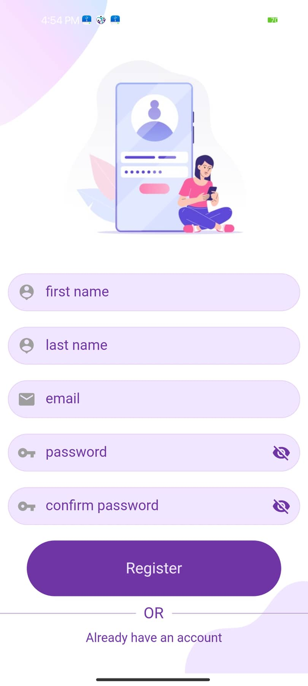

Flutter app (E-Commerce) using firebase as a backend, have information about new capital of Egypt, used to selling compound's units as new units in compounds, and selling used units from any location, each unit(Apartment, villa, etc....) have the title, images of the place , location on map and rate of users , compounds are splited and user who lives in that compound can rate it.
# aqarborker_screenshots

,
,
,
,
,
,
,
,
,
,
,
,
, ,

